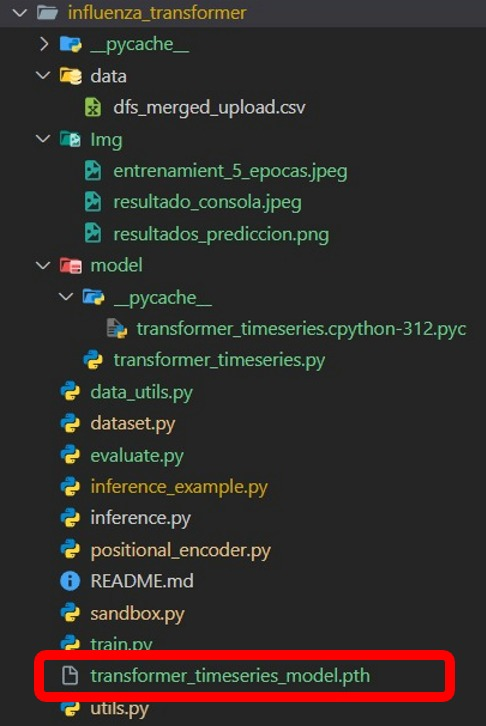
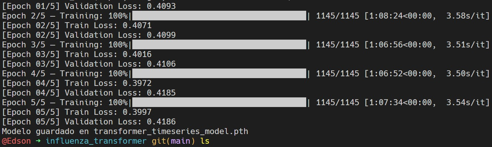
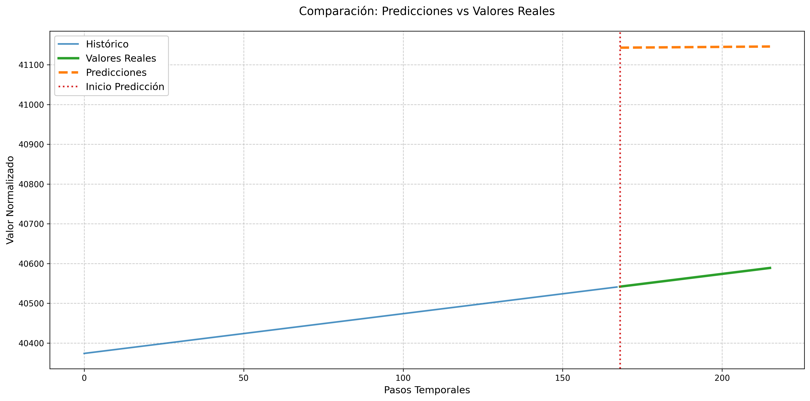
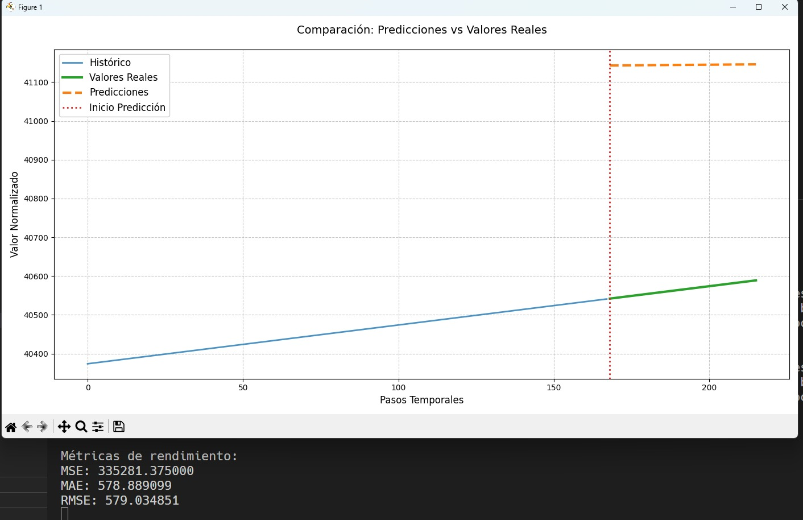

# Nombres completos:
## - Edson Bryan Béjar Román.

----------------------------------

# 🧠 Deep Transformer para Series Temporales – Influenza Prevalence Case

Este repositorio contiene la implementación y prueba del modelo **Transformer para series temporales**, me basé en el paper:

> **"Deep Transformer Models for Time Series Forecasting: The Influenza Prevalence Case"**  
> DOI: [10.48550/arXiv.2001.08317](https://doi.org/10.48550/arXiv.2001.08317) y ejecuté el repositorio: [https://github.com/KasperGroesLudvigsen/influenza_transformer/](https://github.com/KasperGroesLudvigsen/influenza_transformer/))

---

## 🎯 Objetivo

Ahora, el objetivo, a parte de replicar el modelo propuesto en el artículo mencionado, evaluando su comportamiento inicial sobre datos de prevalencia de influenza, fue entrenar nbeats con el mismo dataset del paper original y comparar ambos modelos para ver un resultado.

---
## Consideraciones

Para la correcta ejecución de este repositorio, se implementó varios scripts que no soy originales del repositorio original.
Se implementaron los script de `train.py` con el cual se generó el archivo ``transformer_timeseries_model.pth``; luego, se implementó `evaluate.py`, `data_utils.py` y hubo algunas modificaciones en los archivos `positional_encoder.py`, `dataset.py`.

-------------

🖥️ Entorno de ejecución:
- CPU (sin GPU)

- Procesador: antiguo

- PyTorch

- Entrenamiento limitado a 5 épocas (≈7 horas)

## 🛠️ Tecnologías usadas

- Python 3.10+
- PyTorch
- NumPy
- Matplotlib
- Pandas

-----------------

## 📁 Archivos subidos: 
- train.py.

- evaluate.py.

- dataset.py.

- data_utils.py.

- inference.py.

- inference_example.py.

- positional_encoder.py.

- sandbox.py.
  
- utils.py.

- model / transformer_timeseries.py

> ⚠️ No se subió el archivo generado del entrenamiento`transformer_timeseries_model.pth`.

> Captura de la estructura del proyecto:

> 

## 📉 Resultados obtenidos:
- MSE: 335281.37.

- MAE: 578.89.

- RMSE: 579.03.

Las predicciones fueron planas y sobreestimadas debido al bajo número de épocas y las restricciones del entorno. Sin embargo, el modelo se ejecutó correctamente, y se visualizó la salida comparando histórico, real y predicción.

📸 Evidencias:

>Captura del entrenamiento de 5 épocas:

>

 
>Captura del gráfico de predicción:

> 

>Captura resultado en consola:

>

## 📈 Consideraciones futuras:

- Entrenamiento con más épocas (cuando disponga de mejor hardware).

- Ajustes de hiperparámetros.

- Evaluación en otros datasets.

- Desarrollo del plan de tesis sobre esta base.

## 📚 Referencia 

> **"Deep Transformer Models for Time Series Forecasting: The Influenza Prevalence Case"**  
> DOI: [10.48550/arXiv.2001.08317](https://doi.org/10.48550/arXiv.2001.08317)

> Github original: [https://github.com/KasperGroesLudvigsen/influenza_transformer/](https://github.com/KasperGroesLudvigsen/influenza_transformer/)
