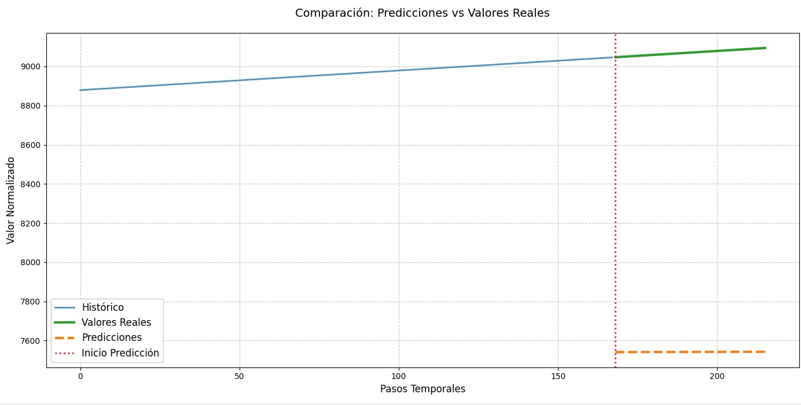
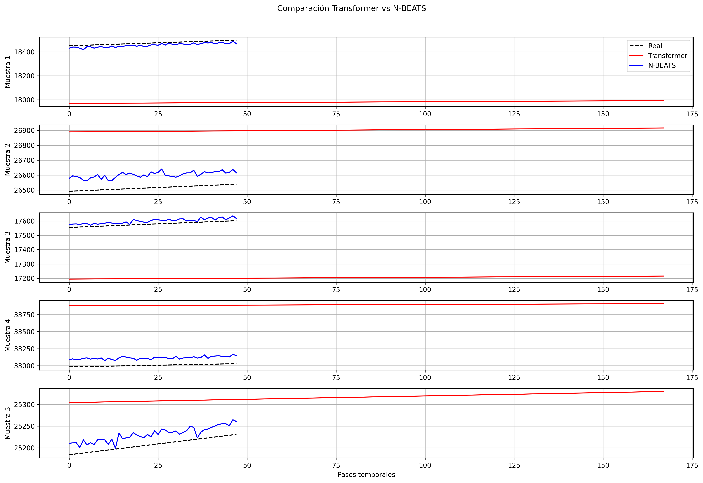

# Nombres completos:
## - Edson Bryan Béjar Román.

----------------------------------

# 🧠 Deep Transformer para Series Temporales – Influenza Prevalence Case

Este repositorio contiene la implementación y prueba del modelo **Transformer para series temporales**, me basé en el paper:

> **"Deep Transformer Models for Time Series Forecasting: The Influenza Prevalence Case"**  
> DOI: [10.48550/arXiv.2001.08317](https://doi.org/10.48550/arXiv.2001.08317) y ejecuté el repositorio: [https://github.com/KasperGroesLudvigsen/influenza_transformer/](https://github.com/KasperGroesLudvigsen/influenza_transformer/))

También contiene la implementación de nbeats y se hizo la comparativa de ambos modelos.
---

## 🎯 Objetivo

Ahora, el objetivo, a parte de replicar el modelo propuesto en el artículo mencionado, evaluando su comportamiento inicial sobre datos de prevalencia de influenza, fue entrenar nbeats con el mismo dataset del paper original y comparar ambos modelos para ver un resultado.

---
## Consideraciones

Para la correcta ejecución de este repositorio, se implementó varios scripts que no son propios del repositorio original.
Se implementaron los script de `train.py` con el cual se generó el archivo ``transformer_timeseries_model.pth``; luego, se implementó `evaluate.py`, `data_utils.py` y hubo algunas modificaciones en los archivos `positional_encoder.py`, `dataset.py`.
A parte se implementaron los scripts `nbeats.py`, `trainnbeats.py` y `comparacion.py` (de ambos modelos).

-------------

🖥️ Entorno de ejecución:
- CPU

- Procesador: ( Intel® Core™ Ultra 7 265K) mejor procesador que la semana pasada 

- PyTorch

- Entrenamiento con 15 épocas (demoró menos tiempo que en el entrenamiento de 5 épocas de la semana pasada con el anterior procesador antiguo que tenía).

## 🛠️ Tecnologías usadas

- Python 3.10+
- PyTorch
- NumPy
- Matplotlib
- Pandas

-----------------

## 📁 Archivos subidos: 
- train.py.

- evaluate.py.

- dataset.py.

- data_utils.py.

- inference.py.

- inference_example.py.

- positional_encoder.py.

- sandbox.py.
  
- utils.py.
- nbeats.py

- train_nbeats.py
  
- comparacion.py

- model / transformer_timeseries.py

> ⚠️ No se subió el archivo generado del entrenamiento`transformer_timeseries_model.pth`.
> ⚠️ Tampoco se subió el archivo generado del entrenamiento de nbeats `nbeats_model.pth`

> Captura de la estructura del proyecto:

> 

## 📉 Resultados obtenidos con entrenamiento de 15 épocas del modelo transformers:
- MSE: 335281.37.

- MAE: 578.89.

- RMSE: 579.03.

📸 Evidencias:

>Captura del entrenamiento de 15 épocas:

>

 
>Captura del gráfico de comparación entre Transformers y nbeats:

> 

## 📚 Referencia 

> **"Deep Transformer Models for Time Series Forecasting: The Influenza Prevalence Case"**  
> DOI: [10.48550/arXiv.2001.08317](https://doi.org/10.48550/arXiv.2001.08317)

> Github original: [https://github.com/KasperGroesLudvigsen/influenza_transformer/](https://github.com/KasperGroesLudvigsen/influenza_transformer/)
